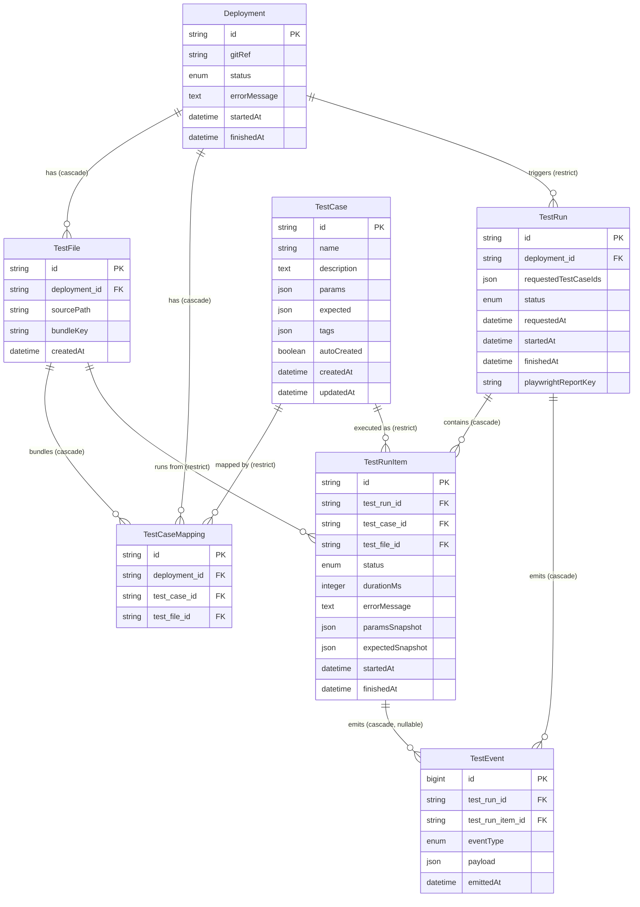

# @platform/admin-server

The admin-facing Next.js server for the Playwright test platform. It manages deployments, test cases and files, test runs, and raw reporter events.

## Scripts

- `pnpm --filter @platform/admin-server dev` — development server (port 3000)
- `pnpm --filter @platform/admin-server build` — Next.js production build
- `pnpm --filter @platform/admin-server test` — unit tests (vitest)
- `pnpm --filter @platform/admin-server test:integration` — integration tests
- `pnpm --filter @platform/admin-server mikro-orm` — MikroORM CLI (migrations, etc.)

## Entity relationships

ERD of the MikroORM-managed entities. Labels use `cascade` / `restrict` to indicate the `deleteRule` on each foreign key.

## Entity summary

- **Deployment** — A bundle deployment keyed by a Git reference (`gitRef`). Tracks lifecycle status and any error message.
- **TestCase** — A logical test case recognized by the platform, with parameters, expectations, and tags. `autoCreated` marks cases discovered automatically during ingestion.
- **TestFile** — A compiled test bundle file that belongs to a deployment. `bundleKey` points to its location in storage.
- **TestCaseMapping** — Join table recording which `TestCase` lives in which `TestFile` for a given `Deployment`. `(deployment, testCase)` is unique.
- **TestRun** — A run request targeting a deployment. Holds the requested `TestCase` ids, status, timing, and the Playwright report key.
- **TestRunItem** — Per-case execution result within a `TestRun`, including a snapshot of `params` / `expected` at run time plus status and error message.
- **TestEvent** — Raw Playwright reporter events. Always tied to a `TestRun`; optionally tied to a `TestRunItem` (run-level events such as stdout may have no item).
